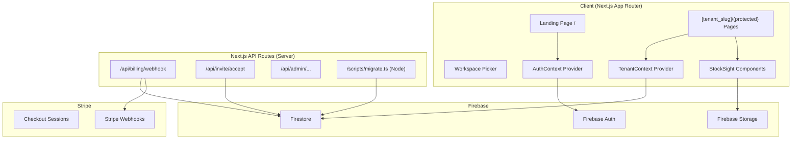
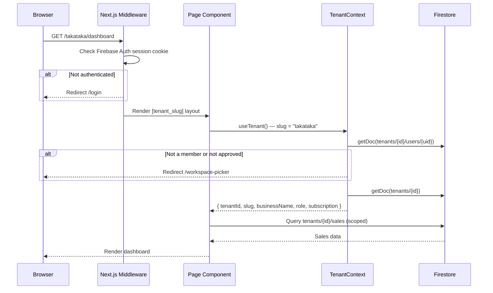

# Design Document

## StockSight — Multi-Tenant SaaS Platform

---

## Overview

StockSight transforms the existing single-tenant "Takataka Pigfood Manager" into a
fully multi-tenant SaaS platform. Any business can sign up, create an isolated workspace
(Tenant), define a dynamic product catalog, and manage sales, customers, and inventory —
with complete data separation from every other tenant.

The existing Takataka Pigfood data is preserved by migrating all flat root-level Firestore
collections into tenant-scoped sub-collections under a first-class tenant document. All
existing workflows (sales, receivals, RBAC, billing, reports) continue to operate inside
that tenant without data loss.

### Key Transformations

| Concern | Before | After |
|---|---|---|
| Data model | Flat root collections (`/sales`, `/customers`) | Tenant sub-collections (`tenants/{id}/sales`) |
| Routing | `/(protected)/dashboard` | `/[tenant_slug]/(protected)/dashboard` |
| Auth context | Single `AppUser` from `users/{uid}` | `TenantContext` + per-tenant membership doc |
| Product catalog | Hardcoded `PRODUCTS` array in `pricing.ts` | Dynamic Firestore-backed `products` sub-collection |
| Sale data model | Flat `SaleItems`/`SaleTotals` on a single doc | `sales` doc + `saleLines` sub-collection |
| Billing | Subscription stored on `users/{uid}` | Subscription stored on `tenants/{tenantId}` |
| Firestore rules | No rules (relies on auth state only) | Tenant-scoped deny-by-default security rules |

---

## Architecture

### High-Level Component Diagram



### Request Flow for a Protected Page



---

## Components and Interfaces

### 1. TenantContext

New React context replacing the current single-user model. Wraps all `[tenant_slug]/(protected)` routes.

```typescript
// src/contexts/TenantContext.tsx

export interface TenantContextType {
  tenantId: string;
  tenantSlug: string;
  businessName: string;
  logoURL: string | null;
  currency: string;          // ISO 4217, e.g. "KES"
  timezone: string;          // IANA, e.g. "Africa/Nairobi"
  subscription: TenantSubscription | null;
  memberRole: UserRole;
  memberStatus: UserStatus;
  memberPermissions: Partial<GranularPermissions>;
  loading: boolean;
  // Derived helpers
  canAccess: (tier: PlanTier) => boolean;
  tenantRef: () => DocumentReference;  // tenants/{tenantId}
  collectionRef: (name: string) => CollectionReference; // tenants/{tenantId}/{name}
}
```

**Resolution flow:**
1. Read `tenant_slug` from the URL segment via `useParams()`.
2. Query `tenants` where `slug == tenant_slug` to resolve `tenantId`.
3. Load `tenants/{tenantId}/users/{uid}` for membership + role.
4. Load `tenants/{tenantId}` for settings + subscription.
5. Expose a real-time `onSnapshot` on the membership doc (status changes propagate within 5 seconds per Req 6.7).

### 2. AuthContext (updated)

The existing `AuthContext` is slimmed down — it retains Firebase Auth state (`user`, `appUser` from the global `users/{uid}` doc for display-name/photo), but no longer drives routing. Routing is now driven by `TenantContext`.

The global `users/{uid}` collection is retained only for:
- Storing `displayName`, `photoURL`, `email` (profile fields not tenant-specific).
- Resolving which tenants a user belongs to on login (query `collectionGroup("users")` where `uid == auth.uid`).

### 3. Firestore Service Layer (updated)

`src/lib/firestore.ts` is refactored to accept a `tenantId` parameter on every function rather than reading from a global. This ensures all reads/writes are explicitly scoped.

```typescript
// Every function signature will change from:
export async function getAllSales(): Promise<Sale[]>

// To:
export async function getAllSales(tenantId: string): Promise<Sale[]>

// Path changes from:
collection(db, "sales")
// To:
collection(db, "tenants", tenantId, "sales")
```

A `useTenantFirestore()` hook wraps this, pulling `tenantId` from `TenantContext` and returning pre-bound versions of all service functions so callsites do not need to pass `tenantId` explicitly.

### 4. Product Catalog Service

New service replacing the hardcoded `PRODUCTS` array.

```typescript
// src/lib/products.ts

export interface Product {
  id: string;
  name: string;
  unit: string;
  price: number;           // catalog price
  isActive: boolean;
  createdAt: Timestamp;
  createdBy: string;
}

// CRUD operations — all scoped to tenants/{tenantId}/products
export async function getActiveProducts(tenantId: string): Promise<Product[]>
export async function addProduct(tenantId: string, data: ProductFormData, uid: string): Promise<string>
export async function updateProduct(tenantId: string, id: string, data: Partial<ProductFormData>): Promise<void>
export async function setProductActive(tenantId: string, id: string, isActive: boolean): Promise<void>
```

The `src/utils/pricing.ts` `PRODUCTS` constant is retained **only** during migration (to seed the Takataka tenant's catalog). After migration it is no longer the source of truth.

### 5. Sale Service (updated data model)

The flat `SaleItems`/`SaleTotals` model is replaced with a two-level structure:

```
tenants/{tenantId}/sales/{saleId}           ← sale header doc
tenants/{tenantId}/sales/{saleId}/saleLines/{lineId}  ← one per line item
```

### 6. Invitation Service

```typescript
// src/lib/invitations.ts

export interface Invitation {
  id: string;
  email: string;
  role: UserRole;
  invitedBy: string;          // uid of inviter
  expiresAt: Timestamp;       // 48h from creation
  tenantId: string;
  tenantSlug: string;
}

export async function createInvitation(tenantId: string, email: string, role: UserRole, inviterUid: string): Promise<string>
export async function acceptInvitation(inviteId: string, uid: string): Promise<void>
export async function getInvitation(inviteId: string): Promise<Invitation | null>
```

Invite links take the form: `https://stocksight.app/invite/{inviteId}`

### 7. Tenant Registration Service

```typescript
// src/lib/tenantRegistration.ts

export async function registerTenant(payload: {
  businessName: string;
  slug: string;
  ownerName: string;
  email: string;
  password: string;
}): Promise<{ tenantId: string; slug: string }>
```

This function performs the atomic multi-step registration. Due to Firebase's lack of true cross-collection transactions with Auth, the sequence is:

1. Check slug uniqueness (Firestore query).
2. `createUserWithEmailAndPassword`.
3. Batch write: tenant doc + user membership doc.
4. On batch failure, delete the Auth account and throw.

### 8. Billing Service (updated)

The webhook route is updated to resolve a tenant by `stripeCustomerId` stored on `tenants/{tenantId}.subscription.stripeCustomerId` instead of `users/{uid}`.

```typescript
// Firestore lookup changes from:
getUserByStripeCustomerId(stripeCustomerId)
// To:
getTenantByStripeCustomerId(stripeCustomerId)
// which queries: tenants where subscription.stripeCustomerId == stripeCustomerId
```

### 9. Migration Script

```
scripts/migrate.ts   ← runs with ts-node + firebase-admin
```

Uses Firebase Admin SDK (bypasses Security Rules). Reads each root collection and batch-writes into `tenants/takataka/{collection}` with document ID preservation.

---

## Data Models

### Firestore Collections

#### `tenants/{tenantId}` (tenant document)

```typescript
interface TenantDoc {
  slug: string;               // e.g. "takataka" — indexed, unique
  businessName: string;
  logoURL?: string;
  currency: string;           // ISO 4217 default "KES"
  timezone: string;           // IANA default "Africa/Nairobi"
  createdAt: Timestamp;
  createdBy: string;          // owner uid
  subscription?: TenantSubscription;
}

interface TenantSubscription {
  planTier: PlanTier;         // "basic" | "standard" | "pro"
  status: SubscriptionStatus;
  stripeCustomerId: string;
  stripeSubscriptionId: string;
  currentPeriodEnd: Timestamp;
  cancelAtPeriodEnd: boolean;
}
```

#### `tenants/{tenantId}/users/{uid}` (membership document)

```typescript
interface TenantMember {
  uid: string;
  email: string | null;
  displayName: string | null;
  photoURL: string | null;
  role: UserRole;             // "owner" | "admin" | "staff" | "viewer"
  status: UserStatus;         // "pending" | "approved" | "rejected" | "suspended"
  permissions?: Partial<GranularPermissions>;
  adminMessage?: string;
  adminNote?: string;
  createdAt: Timestamp;
}
```

#### `tenants/{tenantId}/invitations/{inviteId}`

```typescript
interface InvitationDoc {
  email: string;
  role: UserRole;
  invitedBy: string;
  expiresAt: Timestamp;
}
```

#### `tenants/{tenantId}/products/{productId}`

```typescript
interface ProductDoc {
  name: string;               // 1–100 chars, unique per tenant (case-insensitive)
  unit: string;               // e.g. "kg", "bag"
  price: number;              // 0.01–999,999,999.99
  isActive: boolean;
  createdAt: Timestamp;
  createdBy: string;
}
```

#### `tenants/{tenantId}/sales/{saleId}` (sale header)

```typescript
interface SaleDoc {
  saleNumber: string;         // e.g. "TAKA-250714-4291"
  customerId: string;
  customerName: string;       // denormalized for display
  grandTotal: number;         // sum of all line totals, rounded to 2dp
  createdBy: string;
  createdAt: Timestamp;
}
```

#### `tenants/{tenantId}/sales/{saleId}/saleLines/{lineId}`

```typescript
interface SaleLineDoc {
  productId: string;
  productName: string;        // denormalized snapshot at sale time
  quantity: number;           // 1–9,999
  unitPrice: number;          // price at time of sale (may differ from catalog)
  lineTotal: number;          // quantity * unitPrice, rounded to 2dp
}
```

#### Retained root-level collections (global, not tenant-scoped)

- `users/{uid}` — global profile (displayName, photoURL, email). No permissions/roles here.
- `user_sessions/{sessionId}` — session tracking (scoped by userId field, not Firestore path).

### Updated TypeScript Types (`src/types/index.ts`)

Key additions/changes:

```typescript
// New
export interface TenantDoc { ... }           // matches Firestore TenantDoc above
export interface TenantSubscription { ... }  // moved from Subscription on AppUser
export interface Product { ... }
export interface SaleLine { ... }
export interface Invitation { ... }
export interface TenantMember { ... }

// Updated — Sale no longer embeds SaleItems/SaleTotals directly
export interface Sale {
  id: string;
  saleNumber: string;
  customerId: string;
  customerName: string;
  grandTotal: number;
  createdBy: string;
  createdAt: Timestamp | Date;
  lines?: SaleLine[];   // populated when loaded with sub-collection
}

// Removed from AppUser
// subscription?: Subscription   ← moved to TenantDoc
```

---

## Next.js Routing Structure

### Before

```
src/app/
  (protected)/
    dashboard/page.tsx
    sales/page.tsx
    ...
  login/page.tsx
  page.tsx              ← redirects to /dashboard
```

### After

```
src/app/
  page.tsx                                    ← public landing / redirect
  login/page.tsx                              ← global sign-in
  register/page.tsx                           ← tenant registration
  workspace-picker/page.tsx                   ← multi-tenant selector
  invite/[inviteId]/page.tsx                  ← invitation acceptance
  [tenant_slug]/
    layout.tsx                                ← TenantContext provider + auth guard
    (protected)/
      layout.tsx                              ← sidebar/navbar shell
      dashboard/page.tsx
      sales/
        page.tsx
        new/page.tsx
        [id]/edit/page.tsx
      customers/
        page.tsx
        [id]/page.tsx
      receivals/
        page.tsx
        new/page.tsx
        [date]/edit/page.tsx
      reports/
        page.tsx
        advanced/page.tsx
        customer-spending/page.tsx
      settings/
        page.tsx                              ← tenant profile/branding
        catalog/page.tsx                      ← product catalog management
        members/page.tsx                      ← user management
        billing/page.tsx
      admin/page.tsx
      profile/page.tsx
  api/
    billing/
      webhook/route.ts                        ← updated for tenant lookup
      create-checkout/route.ts               ← updated for tenant-level subscription
      create-portal/route.ts
    invite/
      accept/route.ts                         ← new
    admin/
      delete-user/route.ts
```

### Next.js Middleware (`src/middleware.ts`)

```typescript
// Handles two concerns:
// 1. Redirect unauthenticated users away from /[tenant_slug]/... paths
// 2. Redirect authenticated users from / to /workspace-picker
// 3. Validate tenant_slug format (reject invalid slugs with 404)

export const config = {
  matcher: ['/((?!_next/static|_next/image|favicon.ico|api).*)'],
};
```

Middleware reads the Firebase Auth session cookie (set via a short-lived `__session` cookie, consistent with Firebase Hosting/Vercel patterns) for fast server-side auth checks without a Firestore round-trip.

---

## Firestore Security Rules

```
rules_version = '2';
service cloud.firestore {
  match /databases/{database}/documents {

    // ── Helpers ────────────────────────────────────────────────────────────
    function isSignedIn() {
      return request.auth != null;
    }

    function isTenantMember(tenantId) {
      return isSignedIn() &&
        exists(/databases/$(database)/documents/tenants/$(tenantId)/users/$(request.auth.uid)) &&
        get(/databases/$(database)/documents/tenants/$(tenantId)/users/$(request.auth.uid)).data.status == 'approved';
    }

    function getTenantMember(tenantId) {
      return get(/databases/$(database)/documents/tenants/$(tenantId)/users/$(request.auth.uid)).data;
    }

    function hasRole(tenantId, role) {
      return isTenantMember(tenantId) && getTenantMember(tenantId).role == role;
    }

    function isOwnerOrAdmin(tenantId) {
      return isTenantMember(tenantId) &&
        (getTenantMember(tenantId).role == 'owner' || getTenantMember(tenantId).role == 'admin');
    }

    // ── Global user profiles (display name, photo — no roles here) ─────────
    match /users/{uid} {
      allow read: if isSignedIn() && request.auth.uid == uid;
      allow write: if isSignedIn() && request.auth.uid == uid;
    }

    // ── Tenant root document (slug lookup, settings, subscription) ─────────
    match /tenants/{tenantId} {
      allow read: if isTenantMember(tenantId);
      allow write: if hasRole(tenantId, 'owner') || hasRole(tenantId, 'admin');

      // ── Members ──────────────────────────────────────────────────────────
      match /users/{uid} {
        allow read: if isTenantMember(tenantId);
        // Users can read their own doc; owners/admins can write
        allow write: if isOwnerOrAdmin(tenantId) || request.auth.uid == uid;
      }

      // ── Invitations ───────────────────────────────────────────────────────
      match /invitations/{inviteId} {
        allow read: if isSignedIn();   // needed for acceptance flow
        allow write: if isOwnerOrAdmin(tenantId);
      }

      // ── Products ──────────────────────────────────────────────────────────
      match /products/{productId} {
        allow read: if isTenantMember(tenantId);
        allow write: if isOwnerOrAdmin(tenantId);
      }

      // ── Customers ─────────────────────────────────────────────────────────
      match /customers/{customerId} {
        allow read: if isTenantMember(tenantId);
        allow create: if isTenantMember(tenantId);
        allow update, delete: if isOwnerOrAdmin(tenantId) ||
          (isTenantMember(tenantId) &&
           getTenantMember(tenantId).permissions.canEditCustomer == true);
      }

      // ── Sales + SaleLines ─────────────────────────────────────────────────
      match /sales/{saleId} {
        allow read: if isTenantMember(tenantId);
        allow create: if isTenantMember(tenantId);
        allow update, delete: if isOwnerOrAdmin(tenantId) ||
          (isTenantMember(tenantId) &&
           getTenantMember(tenantId).permissions.canEditSale == true);

        match /saleLines/{lineId} {
          allow read: if isTenantMember(tenantId);
          allow write: if isTenantMember(tenantId);
        }
      }

      // ── Receivals ─────────────────────────────────────────────────────────
      match /receivals/{receivalId} {
        allow read: if isTenantMember(tenantId);
        allow create: if isTenantMember(tenantId);
        allow update: if isOwnerOrAdmin(tenantId) ||
          (isTenantMember(tenantId) &&
           getTenantMember(tenantId).permissions.canEditSale == true);
        allow delete: if isOwnerOrAdmin(tenantId) ||
          (isTenantMember(tenantId) &&
           getTenantMember(tenantId).permissions.canDeleteSale == true);
      }

      // ── Weekly Notes ──────────────────────────────────────────────────────
      match /weeklyNotes/{weekKey} {
        allow read: if isTenantMember(tenantId);
        allow write: if isOwnerOrAdmin(tenantId);
      }
    }

    // ── Session tracking (tenant-scoped by userId field, not path) ─────────
    match /user_sessions/{sessionId} {
      allow read, write: if isSignedIn() && request.auth.uid == resource.data.userId;
      allow create: if isSignedIn() && request.auth.uid == request.resource.data.userId;
    }

    // ── Deny everything else ───────────────────────────────────────────────
    match /{document=**} {
      allow read, write: if false;
    }
  }
}
```

---

## Correctness Properties

*A property is a characteristic or behavior that should hold true across all valid executions of a system — essentially, a formal statement about what the system should do. Properties serve as the bridge between human-readable specifications and machine-verifiable correctness guarantees.*

---

### Property 1: Tenant slug validation is exact

*For any* string, the slug validator should accept it if and only if it contains only lowercase letters (`a-z`), digits (`0-9`), and hyphens; is between 3 and 30 characters; and does not start or end with a hyphen. Any string that violates any one of these conditions should be rejected.

**Validates: Requirements 1.6, 10.1**

---

### Property 2: Password complexity validation is exact

*For any* string, the password validator should accept it if and only if it is at least 8 characters long and contains at least one uppercase letter, one lowercase letter, one digit, and one special character. Any string missing any one of these characteristics should be rejected.

**Validates: Requirements 1.8**

---

### Property 3: Tenant registration is atomic — all records created or none

*For any* valid registration payload (valid slug, email, password, business name), if the registration flow completes without error, then a Firebase Auth account, a tenant document at `tenants/{tenantId}`, and a user membership document at `tenants/{tenantId}/users/{uid}` must all exist. Conversely, if a Firestore write fails after Auth account creation, the Auth account must be deleted and no partial records should persist.

**Validates: Requirements 1.4, 1.9**

---

### Property 4: Duplicate slug is always rejected

*For any* slug that already exists in the `tenants` collection, submitting a new registration with that exact slug (regardless of timing) should always return a conflict error and must never create a second tenant document with that slug.

**Validates: Requirements 1.3**

---

### Property 5: Firestore path is always tenant-scoped

*For any* `tenantId` and any collection name in `{products, customers, sales, receivals, weeklyNotes, users, user_sessions}`, the path-building function `collectionRef(name)` should produce exactly `tenants/{tenantId}/{name}` — never a root-level path.

**Validates: Requirements 3.1**

---

### Property 6: RBAC permission evaluation respects override precedence

*For any* user with any role and any map of per-user permission overrides, `canDo(user, permission)` should return the override value for that permission if the override key is present; otherwise it should return the role's default value from `GRANULAR_DEFAULTS`. The global role default must never supersede an explicit per-user override.

**Validates: Requirements 6.6**

---

### Property 7: Product validation accepts exactly the valid input space

*For any* product object, the product validator should accept it if and only if `name` is 1–100 non-whitespace-only characters, `unit` is 1–50 characters, `price` is a number in [0.01, 999,999,999.99], and `isActive` is a boolean. Any product object violating any single field constraint should be rejected.

**Validates: Requirements 4.1**

---

### Property 8: Product name uniqueness is case-insensitive within a tenant

*For any* two product name strings that are equal when both are lowercased, attempting to add the second to a catalog that already contains the first should always be rejected with a duplicate-name error, regardless of the original casing of either name.

**Validates: Requirements 4.2**

---

### Property 9: Sale line prices are immutable after creation

*For any* sale line that has been persisted, updating the catalog price of the referenced product should not change the `unitPrice` stored in that sale line. The sale's `grandTotal` should also remain unchanged after a catalog price update.

**Validates: Requirements 4.4, 5.3, 5.9**

---

### Property 10: Grand total equals sum of line totals

*For any* list of sale lines each with a `quantity` and `unitPrice`, the computed `grandTotal` should exactly equal `Math.round(sum(quantity_i × unitPrice_i) × 100) / 100`. This must hold for any number of lines (1–50), any valid quantity (1–9,999), and any valid unit price (0.01–999,999,999.99).

**Validates: Requirements 5.9**

---

### Property 11: Sale number format matches tenant prefix pattern

*For any* tenant whose slug starts with at least 4 characters, the generated sale number should match the regular expression `^[A-Z]{4}-\d{6}-\d{4}$` where the first four characters are the uppercased first four characters of the tenant slug. For slugs shorter than 4 characters, the prefix should be the full uppercased slug padded to 4 characters.

**Validates: Requirements 5.10**

---

### Property 12: Logo upload validator rejects invalid files

*For any* file with a given MIME type and byte size, the logo validator should accept it if and only if the MIME type is one of `image/jpeg`, `image/png`, or `image/webp`, and the file size is less than or equal to 2,097,152 bytes (2 MB). Any file failing either condition must be rejected and the existing `logoURL` must remain unchanged.

**Validates: Requirements 7.3, 7.4**

---

### Property 13: Plan tier access follows strict rank ordering

*For any* tenant subscription with status `active` or `trialing`, `canAccessPlan(tenantId, requiredTier)` should return `true` if and only if `TIER_RANK[subscription.planTier] >= TIER_RANK[requiredTier]`. For any subscription with status `past_due`, `canceled`, or `none`, the function should return `false` regardless of tier.

**Validates: Requirements 8.4, 8.5, 8.6**

---

### Property 14: Migration preserves document counts

*For any* source collection with N documents, after a successful migration run the destination sub-collection at `tenants/takataka/{collection}` should contain exactly N documents (assuming no prior documents existed at the destination). For any document that already exists at the destination (idempotent re-run), the migration must skip it without modifying it and the destination count must remain N.

**Validates: Requirements 9.7, 9.8**

---

### Property 15: Net weight arithmetic invariant

*For any* receival record where both `weightIn` and `weightOut` are provided in the range (0, 99,999] with `weightIn > weightOut`, the persisted `netWeight` must exactly equal `weightIn - weightOut`. No rounding, truncation, or approximation is permitted.

**Validates: Requirements 11.4**

---

## Error Handling

### Registration Failures

| Failure Point | Recovery Action |
|---|---|
| Slug already taken | Inline form error, no records created |
| Email already registered | Inline form error, no records created |
| Auth account created, Firestore batch fails | Delete Auth account, show "Registration failed" |
| Password fails complexity | Inline validation error before any Firebase call |

### Tenant Context Failures

| Failure Point | Recovery Action |
|---|---|
| Tenant doc not found for slug | Show "Workspace not found" page with link to workspace-picker |
| User not a member of tenant | Redirect to workspace-picker with "Access denied" message |
| User status is `suspended` | Redirect to `/suspended` page |
| User status is `pending` | Redirect to `/pending-approval` page |
| Firestore permission denied | Show "You do not have access to this workspace" + redirect |

### Sale Submission Failures

| Failure Point | Recovery Action |
|---|---|
| No lines with quantity > 0 | Inline validation error, form remains open |
| Firestore write failure | Show error toast, form stays open with data preserved |
| Sale number collision | Regenerate 4-digit suffix and retry (up to 5 attempts) |

### Billing / Stripe Failures

| Failure Point | Recovery Action |
|---|---|
| Checkout session creation fails | Show error toast on billing page |
| Webhook signature invalid | Return 400, log and alert |
| Tenant not found by Stripe customer ID | Log warning and return 200 (avoid Stripe retry loop) |
| Subscription status `past_due` / `canceled` | Read-only mode banner shown to all tenant members |

### Invitation Failures

| Failure Point | Recovery Action |
|---|---|
| Invitation link expired | Show "Invitation expired, request a new one" page |
| Plan member limit reached at acceptance | Reject acceptance, show upgrade prompt |
| Sign-in fails during acceptance | Show auth error, preserve invitation doc for retry |

### Migration Script Failures

| Failure Point | Recovery Action |
|---|---|
| Document write fails | Skip document, log `{collection, docId, error}`, continue |
| Source collection read fails | Abort collection, log, continue to next collection |
| Completion with any errors | Exit with non-zero exit code |

---

## Testing Strategy

### Unit Tests (Vitest)

Focused on pure functions with specific examples and edge cases:

- `validateSlug(slug)` — correct/boundary/edge strings
- `validatePassword(password)` — correct/boundary/edge strings
- `validateProduct(product)` — valid and invalid product shapes
- `calculateGrandTotal(lines)` — specific line combinations including rounding edge cases
- `generateSaleNumber(slug)` — format correctness for various slug lengths
- `canDo(user, permission)` — role defaults and override precedence examples
- `canAccessPlan(subscription, tier)` — all tier/status combinations
- `validateLogoFile(mimeType, sizeBytes)` — boundary cases around 2 MB and valid/invalid MIME types
- `buildTenantPath(tenantId, collection)` — correct path construction

### Property-Based Tests (fast-check, Vitest integration)

The property-based testing library is [fast-check](https://fast-check.io/), chosen because it integrates directly with Vitest and TypeScript, has strong arbitrary generators for strings and numbers, and is actively maintained.

Each property test runs a minimum of **100 iterations**.

Tag format: `// Feature: multi-tenant-saas-platform, Property {N}: {property_title}`

| Test | Design Property | fast-check Arbitraries |
|---|---|---|
| Slug validator accepts all valid slugs | Property 1 | `fc.stringMatching(/^[a-z0-9][a-z0-9-]{1,28}[a-z0-9]$/)` + `fc.string()` for invalids |
| Password validator accepts all valid passwords | Property 2 | Composed arbitraries with guaranteed character classes |
| Product validator accepts/rejects correctly | Property 7 | `fc.record(...)` with valid/invalid field combos |
| Case-insensitive duplicate name detection | Property 8 | `fc.string({ minLength: 1, maxLength: 100 })` with case mutations |
| Grand total equals sum of line totals | Property 10 | `fc.array(fc.record({ quantity: fc.integer({min:1,max:9999}), unitPrice: fc.float({min:0.01,max:999999999.99}) }), {minLength:1,maxLength:50})` |
| Sale number format matches pattern | Property 11 | `fc.string({ minLength: 3, maxLength: 30 })` for tenant slug |
| Logo validator rejects invalid files | Property 12 | `fc.string()` for MIME + `fc.integer()` for size |
| Plan tier rank ordering | Property 13 | All tier/status combos via `fc.constantFrom(...)` |
| Net weight arithmetic | Property 15 | `fc.tuple(fc.float({min:0.01,max:99999}), fc.float({min:0.01,max:99999})).filter(([a,b]) => a > b)` |

Properties 3, 4, 5, 6, 9, and 14 involve Firestore or Auth and are covered by integration tests rather than property tests (see below).

### Integration Tests

Firestore Emulator-based tests verifying:

- Non-members receive `PERMISSION_DENIED` when reading `tenants/{id}/sales`.
- Suspended users cannot write to any tenant sub-collection.
- An owner can read/write their own tenant, but not another tenant's data.
- The migration script produces correct document counts in the emulator.
- The Stripe webhook correctly updates `tenants/{tenantId}/subscription`.

### End-to-End Tests (future, Playwright)

- Full registration → dashboard flow.
- Invite acceptance flow.
- Plan gate enforcement (basic plan blocked from receivals).

### Dual Testing Approach Summary

Unit tests catch concrete bugs with specific examples. Property tests verify that correct behavior generalizes across the input space — particularly critical for validators (slug, password, product fields) and arithmetic (grand totals, net weights), where off-by-one errors or edge cases in character handling are the most common failure modes.
